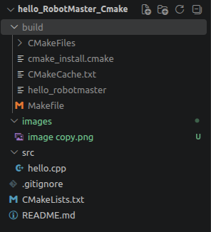
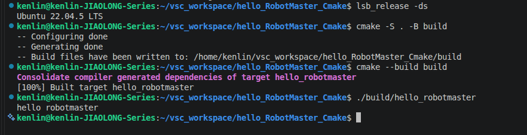
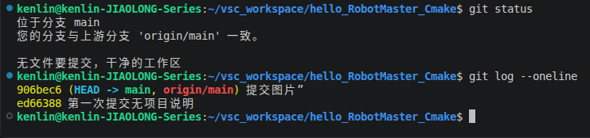

# CMake Hello World — RoboMaster 第一次作业

## 1. 项目简介

本项目使用 CMake 构建一个 C++17 控制台程序，演示从配置、编译到运行的完整流程。

仓库地址：[RoboMaster-Algorithm-Team-First-Assignment](https://github.com/wangsmile0099-lab/RoboMaster-Algorithm-Team-First-Assignment)。

作业要求程序输出：

```text
Hello, RoboMaster!
```

**当前版本说明：** 当前源文件为 `src/hello.cpp`，生成的可执行文件为 `hello_robotmaster`，实际输出为 `hello robotmaster`。以下构建和运行命令与当前代码一致；提交前需按第 6 节统一到作业要求。

## 2. 环境信息

| 项目 | 本地验证环境 |
| --- | --- |
| 操作系统 | Ubuntu 22.04.5 LTS |
| C++ 编译器 | GCC / g++ 11.4.0 |
| CMake | 3.22.1（项目最低要求为 3.16） |
| C++ 标准 | C++17 |

在 Ubuntu 22.04 中安装所需工具：

```bash
sudo apt update
sudo apt install -y build-essential cmake git
```

查看环境版本：

```bash
lsb_release -ds
g++ --version
cmake --version
git --version
```

## 3. 目录结构

```text
RoboMaster-Algorithm-Team-First-Assignment/
├── CMakeLists.txt                  # CMake 配置，指定 C++17 和构建目标
├── README.md                       # 项目说明与复现步骤
├── .gitignore                      # 排除 /build/ 构建产物
├── src/
│   └── hello.cpp                   # 当前程序源文件
├── images/
│   ├── ubuntu与cmake构建成功.png    # Ubuntu 环境、构建过程和运行输出
│   ├── 项目结构.png                # 项目目录截图
│   └── git截图.png                 # Git 状态及提交记录截图
└── build/                          # 构建时自动生成，不纳入版本控制
```

项目结构截图如下。截图记录的是整理前的状态，其中的 `image copy.png` 为旧图片名称；当前文件名以以上目录树为准。



## 4. 获取、构建与运行

首次获取项目：

```bash
git clone https://github.com/wangsmile0099-lab/RoboMaster-Algorithm-Team-First-Assignment.git
cd RoboMaster-Algorithm-Team-First-Assignment
```

如果已经下载项目，请先进入包含 `CMakeLists.txt` 的仓库根目录。下面所有命令均从仓库根目录执行。

### 配置

```bash
cmake -S . -B build
```

其中 `-S .` 指定当前目录为源码目录，`-B build` 指定构建产物存放目录。成功时会显示 `Build files have been written to: .../build`。

### 编译

```bash
cmake --build build
```

成功时的关键输出：

```text
[100%] Built target hello_robotmaster
```

### 运行

```bash
./build/hello_robotmaster
```

当前版本的预期输出：

```text
hello robotmaster
```

## 5. 运行结果与 Git 记录

### 环境、构建和运行截图

下图展示 Ubuntu 22.04.5 LTS 系统信息、CMake 配置与构建命令、构建成功信息，以及当前程序的实际输出。



关键结果：

```text
Ubuntu 22.04.5 LTS
[100%] Built target hello_robotmaster
hello robotmaster
```

### Git 状态与提交记录

下图记录了截图时的工作区状态和两次提交：`ed66388`（第一次提交无项目说明）、`906bec6`（提交图片）。截图中的“干净的工作区”仅代表截图时的状态。



## 6. 提交前核对

当前项目已在上述环境中完成配置、编译和运行验证，但要严格符合题目，仍需完成以下调整：

- 将源文件 `src/hello.cpp` 改为 `src/main.cpp`，并同步更新 `CMakeLists.txt` 中的源文件路径。
- 将 CMake 构建目标 `hello_robotmaster` 改为 `hello`，同步更新相关目标配置及本文运行命令。
- 将程序输出改为精确的 `Hello, RoboMaster!`，注意大小写、逗号和感叹号。
- 重新截图并保存为题目指定的 `images/success.png`，展示 Ubuntu 22.04 系统信息、配置与构建命令、`[100%] Built target hello` 及正确输出，并更新本文引用。
- 提交 README 和整理后的图片，确认 `build/` 未被跟踪，并保留至少两次有意义的提交。
- 确认仓库为公开仓库，在未登录窗口中可以访问；在另一空目录中重新克隆并完成验收。

完成上述调整后，作业验收命令应为：

```bash
cmake -S . -B build
cmake --build build
./build/hello
```

最终预期输出：

```text
Hello, RoboMaster!
```

## 7. 作者与日期

- 队员：王肖扬
- 学号：2254214782
- RobotMaster算法组第一次作业
